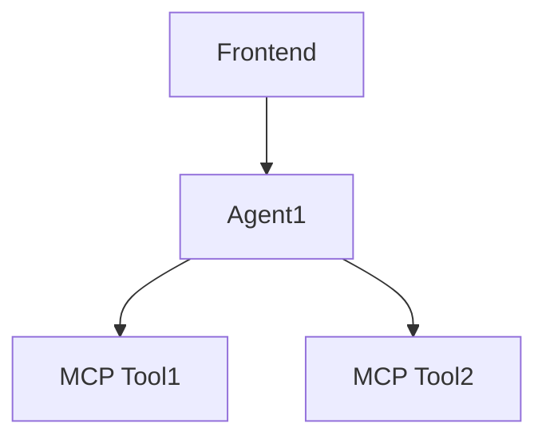
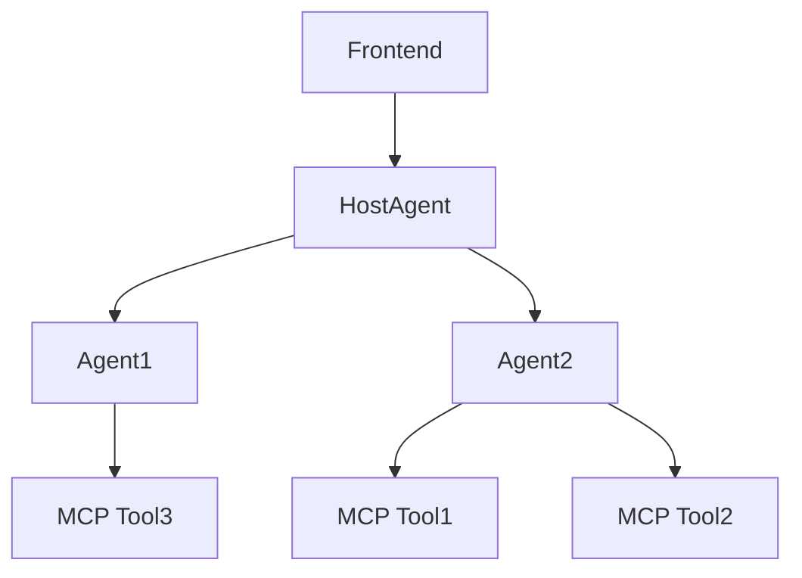

# A2A-MCP Server Framework

📘 [中文Readme](./README_ZH.md)

<div align="center">

[](https://opensource.org/licenses/MIT)
[](https://github.com/psf/black)
[](https://pycqa.github.io/isort/)

**A Fully Compatible Implementation of Google's Agent-to-Agent (A2A) Protocol with Model Context Protocol (MCP) Integration**

</div>

## 🌟 Overview

A2A-MCP Serer Framework is a robust, production-ready solution that leverages Google's [Agent-to-Agent (A2A) protocol](https://google.github.io/A2A/) and integrates seamlessly with the [Model Context Protocol (MCP)](https://contextual.ai/introducing-mcp/). This project is designed for building interoperable single and multi-agent systems with full compatibility with Google's official A2A code. It offers a clear structure, rich examples, and a full-stack, ready-to-use implementation for developers.

Key highlights:
- **100% A2A Compatibility**: Built using Google's official A2A code for maximum interoperability.
- **MCP Integration**: First-class support for MCP, enabling agents to access external tools and data sources.
- **Clear Structure**: Well-organized project with comprehensive examples for single and multi-agent setups.
- **Full-Stack Solution**: Includes both backend (Python) and frontend (Node.js) components for immediate deployment.
- **Rich Examples**: Demonstrates practical use cases for both single-agent and multi-agent collaboration.

## ✨ Why Choose A2A-MCP Server Framework?

- **Complete A2A Implementation**: Adheres strictly to the official A2A specification.
- **Flexible Agent Systems**: Supports both single-agent and multi-agent workflows.
- **MCP Tooling**: Easily integrate external tools via MCP for enhanced agent capabilities.
- **Production-Ready**: Robust error handling and clear documentation for enterprise use.
- **Developer-Friendly**: Rich examples, intuitive setup, and minimal dependencies.

## 📦 Installation

### Prerequisites
- Python 3.10+
- Node.js 16+
- pip for Python dependencies
- npm for frontend dependencies

### Backend Setup
1. Clone the repository:
```bash
git clone https://github.com/johnson7788/A2AServer.git
```

2. Install backend dependencies:
```bash
cd backend/A2AServer
pip install .
```

## 🚀 Quick Start

### Single-Agent Example

#### 1. Start the A2A Agent
- **Agent RAG**:
```bash
cd backend/AgentRAG
python main.py --port 10005
```
#### 2. Start the Frontend
```
cd frontend/single_agent
npm install
npm run dev
```
Open the frontend in your browser, add the agent, and start interacting through the Q&A interface.

## Single Agent Call Flow


### Multi-Agent Setup
This section demonstrates how to set up a multi-agent system with collaboration between A2A agents.

#### 1. Start Agent 1
- **Agent RAG**:
```bash
cd backend/AgentRAG
python main.py --port 10005
```

#### 2. Start Agent 2
```bash
cd backend/DeepSearch
python main.py --port 10004
```

#### 2. Start Host Agent
The host agent coordinates multiple A2A agents, manages their states, and decides which agent to use.
```bash
cd frontend/hostAgentAPI
pip install -r requirements.txt
python api.py
```

#### 3. Start Frontend
```bash
cd frontend/multiagent_front
npm install
npm run dev
```
- Open the frontend in your browser, add agents, and start interacting via the Q&A interface.


## Multi-Agent Call Flow



## 📂 Project Structure
```
A2AServer
├── backend
│   ├── A2AServer           # A2A server dependencies
│   ├── AgentRAG            # RAG-based A2A agent
│   ├── DeepSearch          # DeepSearch A2A agent example
│   ├── client.py           # A2A client for testing
│   └── hostAgentAPI        # Host agent for multi-agent coordination
├── multiagent_front        # Frontend for multi-agent collaboration
├── single_agent            # Frontend for single-agent interaction
└── README.md               # Project documentation
```

## 🛠️ Developing Your Own A2A Server
To create a custom A2A server, follow these steps:

1. **Copy the DeepSearch Example**:
```bash
cp -r backend/DeepSearch backend/MyCustomAgent
```

2. **Directory Structure**:
```angular2html
MyCustomAgent
├── .env                # Environment file for model keys
├── main.py             # A2A server startup script
├── mcp_config.json     # MCP server configuration
├── mcpserver           # MCP server code (optional)
│   └── my_tool.py      # Custom MCP tool
└── prompt.txt          # Agent prompt file
```

3. **Configure MCP Tools**:
- Ensure tool names in `mcp_config.json` use camelCase (e.g., `MyCustomTool`) instead of underscores (e.g., `My_Custom_Tool`) to avoid lookup issues.
- Example `mcp_config.json`:
```json
{
  "tools": [
    {
      "name": "MyCustomTool",
      "description": "A custom tool for processing data",
      "script": "mcpserver/my_tool.py"
    }
  ]
}
```

4. **Run Your Server**:
```bash
cd backend/MyCustomAgent
python main.py --port 10006
```

## ⚠️ Notes
- **Tool Naming**: Use camelCase for tool names in `mcp_config.json` (e.g., `SearchTool`, `RAGTool`) to ensure compatibility.
- **Environment Variables**: Store API keys and sensitive data in the `.env` file.
- **Port Conflicts**: Ensure unique ports for each agent to avoid conflicts.

## 🧩 Core Features
- **Single-Agent Interface**: Simple, intuitive UI for interacting with a single A2A agent.
- **Multi-Agent Collaboration**: Host agent coordinates multiple A2A agents for complex tasks.
- **MCP Integration**: Seamless access to external tools and data via MCP.
- **Rich Examples**: Comprehensive examples for both single and multi-agent setups.
- **Full-Stack**: Backend and frontend components for immediate deployment.

## 🗺️ Use Cases
- **AI-Powered Assistants**: Build intelligent assistants with single or multi-agent setups.
- **Research Tools**: Create collaborative agent systems for data analysis or search.
- **Enterprise Workflows**: Coordinate multiple agents for complex business processes.
- **Educational Platforms**: Demonstrate agent collaboration for learning purposes.

## 📖 Contributing
We welcome contributions! To get started:
1. Fork the repository.
2. Create a feature branch (`git checkout -b feature/my-feature`).
3. Commit your changes (`git commit -m 'Add my feature'`).
4. Push to the branch (`git push origin feature/my-feature`).
5. Open a pull request.

See our [contributing guide](CONTRIBUTING.md) for more details.

## Acknowledgements
This project draws inspiration from and gratefully acknowledges the contributions of the following open-source project:
- [Google A2A Project](https://github.com/google/A2A)


## 🤝 Community & Support
- **[GitHub Issues](https://github.com/johnson7788/A2AServer/issues)**: Report bugs or request features.
- **[GitHub Discussions](https://github.com/johnson7788/A2AServer/discussions)**: Ask questions and share ideas.

## 📄 License
This project is licensed under the MIT License - Free for all.

---

Made with ❤️ by [Johnson Guo](https://github.com/johnson7788)