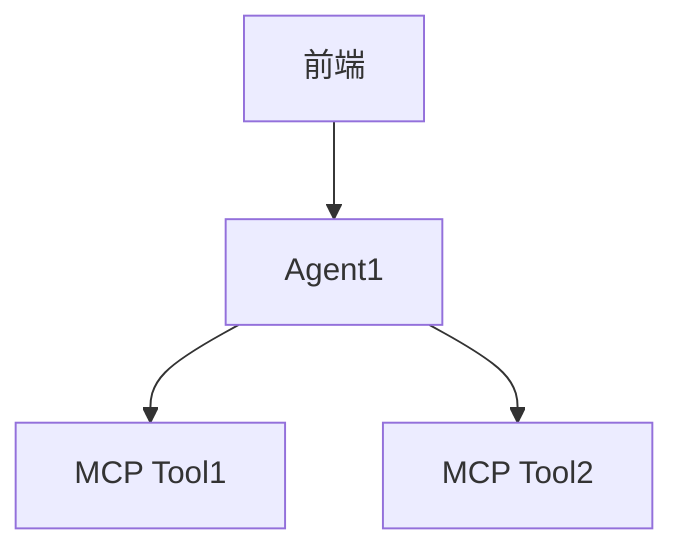
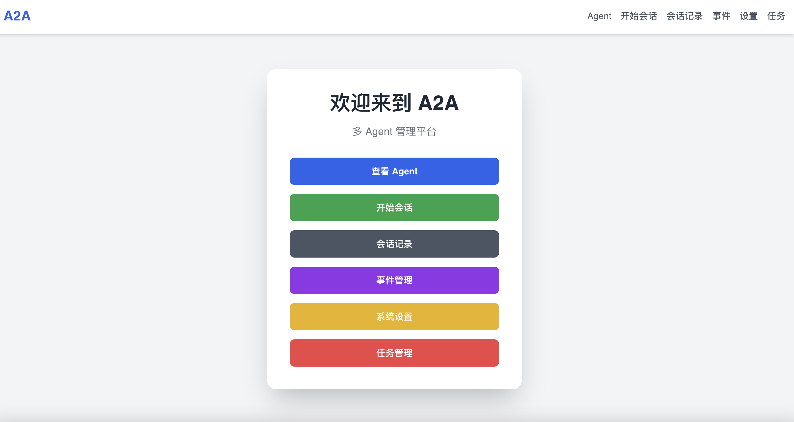
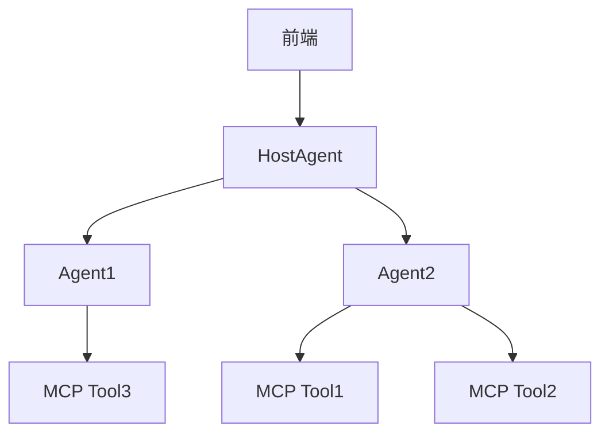

# A2A-MCP 服务器框架

📘 [中文Readme](./README_ZH.md)

<div align="center">

[](https://opensource.org/licenses/MIT)
[](https://github.com/psf/black)
[](https://pycqa.github.io/isort/)

**完全兼容谷歌Agent-to-Agent (A2A) 协议并集成模型上下文协议 (MCP) 的实现**

</div>

## 🌟 概述

A2A-MCP 服务器框架是一个健壮的、生产就绪的解决方案，利用谷歌的 [Agent-to-Agent (A2A) 协议](https://google.github.io/A2A/) 并与 [模型上下文协议 (MCP)](https://contextual.ai/introducing-mcp/) 无缝集成。该项目旨在构建可互操作的单代理和多代理系统，完全兼容谷歌官方A2A代码。它提供了清晰的结构、丰富的示例以及全栈、开箱即用的实现，方便开发者使用。

主要亮点：
- **100% A2A兼容性**：基于谷歌官方A2A代码构建，确保最大互操作性。
- **MCP集成**：一流的MCP支持，使代理能够访问外部工具和数据源。
- **清晰的结构**：项目组织良好，包含单代理和多代理设置的全面示例。
- **全栈解决方案**：包括后端（Python）和前端（Node.js）组件，可立即部署。
- **丰富的示例**：展示单代理和多代理协作的实际用例。

## ✨ 为什么选择A2A-MCP服务器框架？

- **完整的A2A实现**：严格遵循官方A2A规范。
- **灵活的代理系统**：支持单代理和多代理工作流程。
- **MCP工具支持**：通过MCP轻松集成外部工具，提升代理能力。
- **生产就绪**：强大的错误处理和清晰的文档，适合企业使用。
- **开发者友好**：丰富的示例、直观的设置和最小的依赖。
- **多LLM模型支持**: 无缝集成并支持多种领先的语言模型，包括 OpenAI、DeepSeek、Anthropic 和 Ollama，为用户提供灵活性和选择。

## 📦 安装

### 前置条件
- Python 3.10+
- Node.js 16+
- pip 用于Python依赖
- npm 用于前端依赖

### 后端设置
1. 克隆仓库：
```bash
git clone https://github.com/johnson7788/A2AServer.git
```

2. 安装后端依赖：
```bash
cd backend/A2AServer
pip install .
```

### 前端设置
1. 安装多代理或单代理前端的依赖：
```bash
cd multiagent_front  # 或 cd single_agent
npm install
```

## 🚀 快速开始

### 单Agent示例
#### 1. 启动A2A代理
- **Agent RAG**：
```bash
cd backend/AgentRAG
python main.py --port 10005
```

#### 2. 启动前端
```bash
cd frontend/single_agent
npm install
npm run dev
```
- 在浏览器中打开前端，添加代理，并通过问答界面开始交互。

#### 3. UI示例


### 多代理设置
本节展示如何设置多代理系统，实现A2A代理之间的协作。

## 单Agent的调用流程


#### 1. 启动1个Agent
- **Agent RAG**：
```bash
cd backend/AgentRAG
python main.py --port 10005
```

#### 2. 启动第2个Agent
```bash
cd backend/DeepSearch
python main.py --port 10004
```

#### 3. 启动主机代理（用于管理上面启动的2个Agent)
主机代理协调多个A2A代理，管理其状态并决定使用哪个代理。
```bash
cd frontend/hostAgentAPI
pip install -r requirements.txt
python api.py
```

#### 4. 启动前端
```bash
cd frontend/multiagent_front
npm install
npm run dev
```
- 在浏览器中打开前端，添加代理，并通过问答界面开始交互。
#### 5. UI示例


## 多Agent的调用流程


## 📂 项目结构
```
A2AServer
├── backend
│   ├── A2AServer           # A2A服务器依赖
│   ├── AgentRAG            # 基于RAG的A2A代理
│   ├── DeepSearch          # DeepSearch A2A代理示例
│   ├── client.py           # 用于测试的A2A客户端
│   └── hostAgentAPI        # 多代理协调的主机代理
├── multiagent_front        # 多代理协作前端
├── single_agent            # 单代理交互前端
└── README.md               # 项目文档
```

## 🛠️ 开发自己的A2A服务器
要创建自定义A2A服务器，请遵循以下步骤：

1. **复制DeepSearch示例**：
```bash
cp -r backend/DeepSearch backend/MyCustomAgent
```

2. **目录结构**：
```angular2html
MyCustomAgent
├── .env                # 模型密钥的环境文件
├── main.py             # A2A服务器启动脚本
├── mcp_config.json     # MCP服务器配置
├── mcpserver           # MCP服务器代码（可选）
│   └── my_tool.py      # 自定义MCP工具
└── prompt.txt          # 代理提示文件
```

3. **配置MCP工具**：
- 确保`mcp_config.json`中的工具名称使用驼峰命名法（例如`MyCustomTool`）而不是下划线（例如`My_Custom_Tool`），以避免查找问题。
- 示例`mcp_config.json`：
```json
{
  "tools": [
    {
      "name": "MyCustomTool",
      "description": "用于处理数据的自定义工具",
      "script": "mcpserver/my_tool.py"
    }
  ]
}
```

4. **运行服务器**：
```bash
cd backend/MyCustomAgent
python main.py --port 10006
```

## ⚠️ 注意事项
- **工具命名**：在`mcp_config.json`中使用驼峰命名法（例如`SearchTool`、`RAGTool`）以确保兼容性。
- **环境变量**：将API密钥和敏感数据存储在`.env`文件中。
- **端口冲突**：为每个代理确保使用唯一的端口以避免冲突。

## 🧩 核心功能
- **单代理界面**：简单直观的UI，用于与单个A2A代理交互。
- **多代理协作**：主机代理协调多个A2A代理以完成复杂任务。
- **MCP集成**：通过MCP无缝访问外部工具和数据。
- **丰富的示例**：为单代理和多代理设置提供全面的示例。
- **全栈支持**：后端和前端组件可立即部署。

## 🗺️ 使用场景
- **人工智能助手**：构建单代理或多代理的智能助手。
- **研究工具**：创建用于数据分析或搜索的协作代理系统。
- **企业工作流程**：协调多个代理以处理复杂的业务流程。
- **教育平台**：展示代理协作以用于学习目的。

## 📖 贡献
我们欢迎贡献！开始贡献的步骤：
1. Fork仓库。
2. 创建功能分支（`git checkout -b feature/my-feature`）。
3. 提交更改（`git commit -m 'Add my feature'`）。
4. 推送分支（`git push origin feature/my-feature`）。
5. 打开拉取请求。

详情请参阅我们的[贡献指南](CONTRIBUTING.md)。

## 致谢
本项目参考并感谢以下开源项目的贡献：
- [Google A2A 项目](https://github.com/google/A2A)

## 🤝 社区与支持
- **[GitHub Issues](https://github.com/johnson7788/A2AServer/issues)**：报告错误或请求功能。
- **[GitHub Discussions](https://github.com/johnson7788/A2AServer/discussions)**：提问和分享想法。

## 📄 许可证
本项目采用MIT许可证 -  Free for all.

Made with ❤️ by [Johnson Guo](https://github.com/johnson7788)
