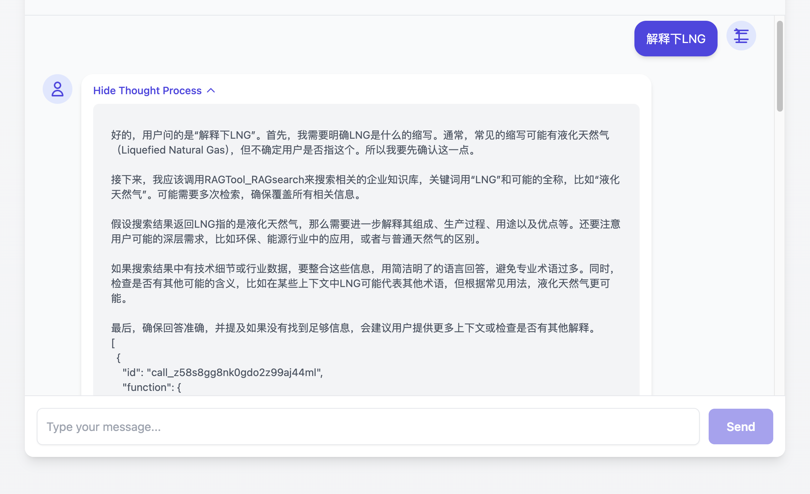

# User Interface (UI) Guide

This guide introduces the main features and usage of the user interface, illustrated with image examples.

## 1. Single Agent Mode

### 1.1 Home Page

The home page of the single agent mode is clean and straightforward, allowing users to interact with a single intelligent agent.

### 1.2 Thought Process

When processing user input, a single agent may display its thought process.

## 2. Multi-Agent Mode

### 2.1 Home Page

The home page of the multi-agent mode displays the available intelligent agents, allowing users to select them for interaction or add new ones.

### 2.2 Add Agent

Users can easily add new intelligent agents to the multi-agent system.

### 2.3 Multi-Agent Conversation

In multi-agent mode, different intelligent agents can collaborate to perform complex conversations and task processing.

